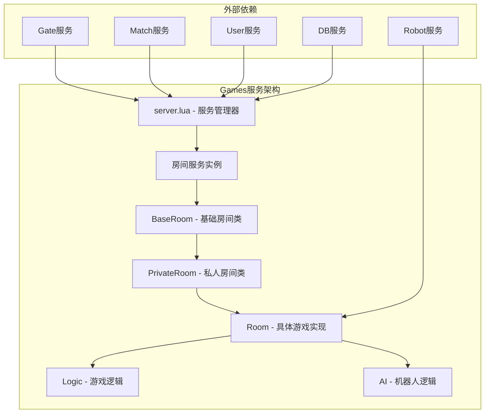
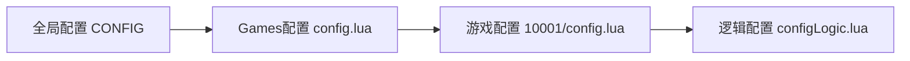
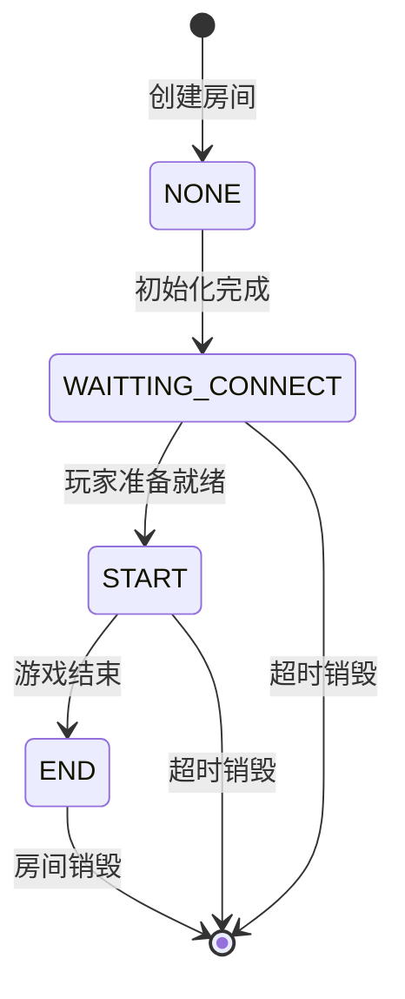
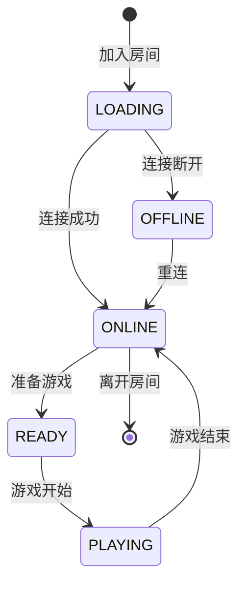
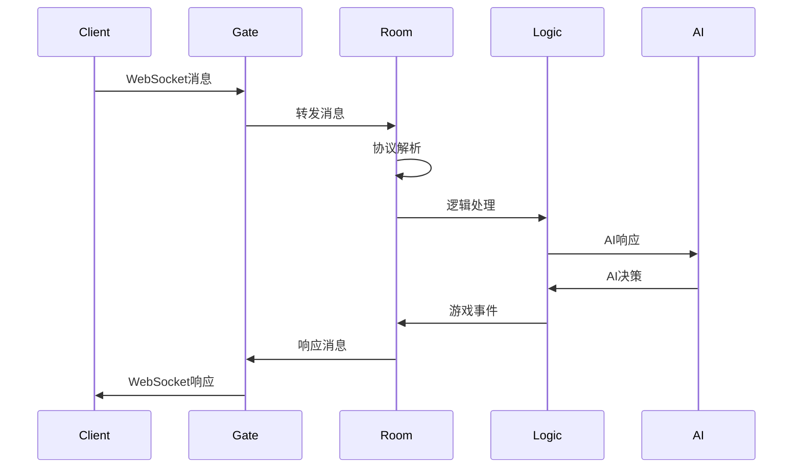

# Games服务架构设计

## 整体架构

Games服务采用分层继承架构，通过面向对象的设计模式实现代码复用和功能扩展。



## 核心组件详解

### 1. 服务管理器 (server.lua)

**职责**：
- 房间生命周期管理
- Sproto协议加载
- 房间路由和分发
- 雪花算法ID生成

**关键功能**：
```lua
-- 房间创建
function createGameRoom(roomType, gameid, players, gameData)
    local roomid = snowflake.generate()
    local gameRoom = skynet.newservice("games/" .. gameid .. "/room")
    -- 初始化和注册房间
end

-- 协议加载
function loadSproto()
    -- 遍历所有游戏ID，加载对应协议
    -- 将协议存储到sharedata中
end
```

### 2. 基础房间类 (BaseRoom)

**设计模式**：模板方法模式
**职责**：
- 房间基础状态管理
- 玩家管理和状态跟踪
- 消息收发机制
- 协议处理框架
- 日志记录

**核心方法**：
```lua
class BaseRoom {
    -- 状态检查
    isRoomStatus(status)
    isRoomStatusWaittingConnect()
    isRoomStatusStarting()
    
    -- 玩家管理
    setPlayerStatusByUserid(userid, status)
    getUseridByFd(fd)
    isUserOnline(userid)
    
    -- 消息处理
    sendToOneClient(userid, name, data)
    sendToAllClient(name, data)
    
    -- 协议加载
    loadSproto()
}
```

### 3. 私人房间类 (PrivateRoom)

**继承关系**：PrivateRoom extends BaseRoom
**设计模式**：装饰器模式
**职责**：
- 私人房间特有功能
- 房主权限管理
- 玩家加入/离开逻辑
- 座位分配管理

**特有功能**：
```lua
class PrivateRoom extends BaseRoom {
    -- 房主权限
    isOwner(userid)
    
    -- 玩家管理
    joinPrivateRoom(userid)
    leaveRoom(userid)
    gameReady(userid, ready)
    
    -- 座位分配
    dispatchSeat()
}
```

### 4. 具体游戏实现 (Room)

**继承关系**：Room extends PrivateRoom
**职责**：
- 游戏特定逻辑实现
- AI机器人集成
- 游戏规则处理
- 结果统计

## 模块化设计

### 游戏模块结构
```
src/services/games/{gameid}/
├── config.lua         # 游戏配置
├── room.lua           # 房间实现
├── logic.lua          # 游戏逻辑
├── ai.lua             # AI逻辑
└── configLogic.lua    # 逻辑配置
```

### 配置层次


## 生命周期管理

### 房间生命周期


### 玩家状态流转


## 消息处理架构

### 协议处理流程


### 消息分发机制
```lua
-- 基于seat的消息分发
function roomHandler.logicMsg(seat, name, data)
    if 0 == seat then
        -- 广播给所有玩家
        roomInstance:sendToAllClient(name, data)
    else
        -- 发送给指定玩家
        local userid = roomInstance.roomInfo.playerids[seat]
        roomInstance:sendToOneClient(userid, name, data)
    end
end
```

## 并发控制

### 房间隔离
- 每个房间运行在独立的Skynet服务实例中
- 房间间无共享状态，避免并发冲突
- 通过消息传递进行服务间通信

### 状态同步
- 房间状态通过数据库持久化
- 玩家状态实时同步到User服务
- 使用分布式锁防止重复操作

## 扩展性设计

### 游戏类型扩展
1. 在`config.gameids`中添加新游戏ID
2. 创建对应的游戏目录和文件
3. 实现游戏特定的Room类
4. 配置对应的协议文件

### 房间类型扩展
- 基于继承关系可轻松扩展新房间类型
- 重写关键方法实现特定功能
- 保持与现有代码的兼容性

## 性能优化

### 协议优化
- Sproto协议预加载到sharedata
- 避免重复解析协议文件
- 二进制协议减少网络传输

### 内存管理
- 房间销毁时清理所有引用
- 使用弱引用避免循环依赖
- 定期检查房间超时

### 计算优化
- AI逻辑异步执行
- 游戏逻辑分帧处理
- 数据库操作批量执行

## 监控和诊断

### 日志记录
```lua
-- 房间事件日志
pushLog(logtype, userid, ext)

-- 游戏结果日志
pushLogResult(type, userid, result, scores...)
```

### 性能监控
- 房间数量统计
- 玩家连接状态
- 消息处理延迟
- 内存使用情况