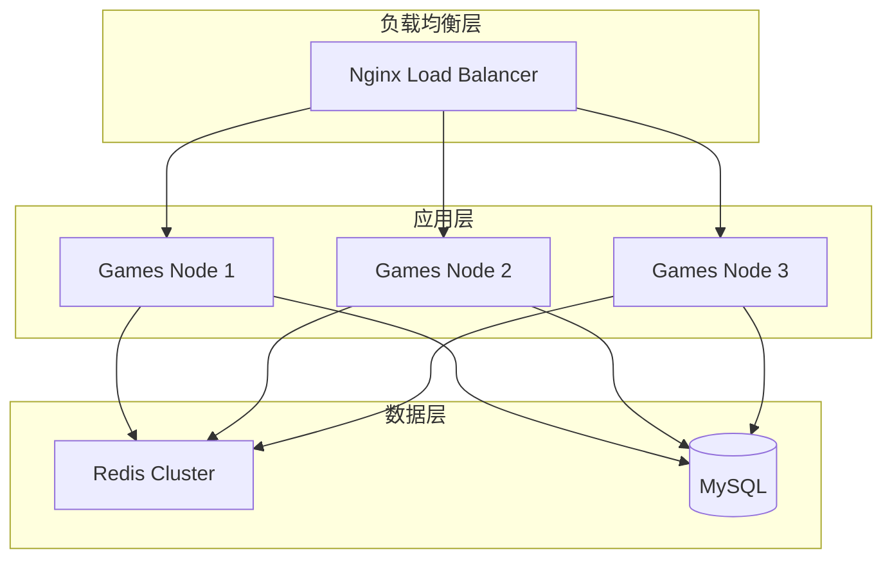

# Games服务部署指南

## 概述

本文档详细介绍Games服务的部署流程、环境要求、配置方法和运维管理。

## 环境要求

### 系统要求

| 组件 | 要求 | 推荐版本 |
|------|------|----------|
| 操作系统 | Linux | Ubuntu 18.04+ / CentOS 7+ |
| CPU | x86_64 | 2核心以上 |
| 内存 | 最低2GB | 4GB以上 |
| 存储 | 10GB可用空间 | SSD存储 |

### 软件依赖

| 软件 | 版本要求 | 说明 |
|------|----------|------|
| GCC | 4.8+ | C编译器 |
| Make | 3.8+ | 构建工具 |
| Git | 2.0+ | 版本控制 |
| Lua | 5.3 | 脚本运行环境 |
| Redis | 3.0+ | 集群配置存储 |

### 可选依赖

| 软件 | 版本 | 用途 |
|------|------|------|
| Docker | 18.09+ | 容器化部署 |
| Nginx | 1.14+ | 反向代理 |
| MySQL | 5.7+ | 数据持久化 |

## 安装部署

### 1. 获取源码

```bash
# 克隆项目
git clone <repository_url> freeGame
cd freeGame

# 检查目录结构
ls -la
```

### 2. 编译Skynet

```bash
# 进入skynet目录
cd skynet

# 编译skynet框架
make

# 验证编译结果
ls -la skynet
```

### 3. 编译依赖库

```bash
# 编译cjson模块（需要修改Makefile）
cd 3rd/lua-cjson
make

# 回到skynet根目录
cd ../..

# 重新编译确保包含cjson
make
```

### Skynet Makefile修改

需要修改`skynet/Makefile`以支持cjson模块：

```makefile
# 在Makefile中添加cjson支持
LUA_CLIB_PATH ?= luaclib
LUA_CLIB = cjson

$(LUA_CLIB_PATH)/cjson.so: 3rd/lua-cjson/cjson.so
	cp $< $@

3rd/lua-cjson/cjson.so:
	cd 3rd/lua-cjson && $(MAKE) CC=$(CC)
```

### 4. 配置服务

#### 创建配置文件

```bash
# 创建配置目录
mkdir -p config

# 复制示例配置
cp examples/config/* config/
```

#### 配置Games服务

创建`config/configGame`文件：

```lua
-- Games服务配置
thread = 8
logger = nil
logpath = "./logs"
harbor = 0
start = "src/services/main"
luaservice = "./src/services/?.lua;./skynet/service/?.lua"
lualoader = "./skynet/lualib/loader.lua"
lua_path = "./src/lualib/?.lua;./skynet/lualib/?.lua;./skynet/lualib/?/init.lua"
lua_cpath = "./skynet/luaclib/?.so"
snax = "./src/services/?.lua;./skynet/examples/?.lua"

-- 游戏特定配置
gameid = 10001
cluster = "game_cluster"
```

### 5. 配置Redis

```bash
# 安装Redis
sudo apt-get install redis-server

# 启动Redis
sudo systemctl start redis
sudo systemctl enable redis

# 测试连接
redis-cli ping
```

## 服务启动

### 1. 启动脚本

创建`sh/runGame.sh`启动脚本：

```bash
#!/bin/bash

# Games服务启动脚本
cd "$(dirname "$0")/.."

SKYNET_PATH="./skynet"
CONFIG_FILE="./config/configGame"
LOG_DIR="./logs"

# 创建日志目录
mkdir -p $LOG_DIR

# 检查skynet是否存在
if [ ! -f "$SKYNET_PATH/skynet" ]; then
    echo "Error: skynet not found, please compile first"
    exit 1
fi

# 检查配置文件
if [ ! -f "$CONFIG_FILE" ]; then
    echo "Error: config file not found: $CONFIG_FILE"
    exit 1
fi

# 启动服务
echo "Starting Games service..."
$SKYNET_PATH/skynet $CONFIG_FILE

echo "Games service started"
```

### 2. 设置执行权限

```bash
chmod +x sh/runGame.sh
```

### 3. 启动服务

```bash
# 启动Games服务
./sh/runGame.sh
```

### 4. 验证启动

```bash
# 检查进程
ps aux | grep skynet

# 检查日志
tail -f logs/game.log
```

## 集群部署

### 1. 集群架构



### 2. 集群配置

#### Redis集群配置

```bash
# Redis集群配置文件
bind 0.0.0.0
port 7000
cluster-enabled yes
cluster-config-file nodes.conf
cluster-node-timeout 5000
appendonly yes
```

#### 节点配置

每个节点的配置文件`config/configGame_node{n}`:

```lua
-- 节点1配置
thread = 8
harbor = 1
cluster = "game_cluster"
address = "192.168.1.10:7001"

-- 节点2配置  
thread = 8
harbor = 2
cluster = "game_cluster"
address = "192.168.1.11:7001"
```

### 3. 启动集群

```bash
# 节点1
./sh/runGame.sh config/configGame_node1

# 节点2  
./sh/runGame.sh config/configGame_node2

# 节点3
./sh/runGame.sh config/configGame_node3
```

## Docker部署

### 1. Dockerfile

```dockerfile
FROM ubuntu:18.04

# 安装依赖
RUN apt-get update && apt-get install -y \
    gcc \
    make \
    git \
    lua5.3 \
    liblua5.3-dev \
    && rm -rf /var/lib/apt/lists/*

# 设置工作目录
WORKDIR /app

# 复制源码
COPY . .

# 编译skynet
RUN cd skynet && make

# 创建日志目录
RUN mkdir -p logs

# 暴露端口
EXPOSE 8001

# 启动命令
CMD ["./sh/runGame.sh"]
```

### 2. Docker Compose

```yaml
version: '3.8'

services:
  games-1:
    build: .
    ports:
      - "8001:8001"
    volumes:
      - ./logs:/app/logs
      - ./config:/app/config
    environment:
      - NODE_ID=1
    depends_on:
      - redis

  games-2:
    build: .
    ports:
      - "8002:8001"
    volumes:
      - ./logs:/app/logs
      - ./config:/app/config
    environment:
      - NODE_ID=2
    depends_on:
      - redis

  redis:
    image: redis:6-alpine
    ports:
      - "6379:6379"
    volumes:
      - redis_data:/data

  nginx:
    image: nginx:alpine
    ports:
      - "80:80"
    volumes:
      - ./nginx.conf:/etc/nginx/nginx.conf
    depends_on:
      - games-1
      - games-2

volumes:
  redis_data:
```

### 3. 启动Docker服务

```bash
# 构建并启动
docker-compose up -d

# 查看服务状态
docker-compose ps

# 查看日志
docker-compose logs games-1
```

## 负载均衡配置

### Nginx配置

```nginx
upstream games_backend {
    server 127.0.0.1:8001 weight=1 max_fails=3 fail_timeout=30s;
    server 127.0.0.1:8002 weight=1 max_fails=3 fail_timeout=30s;
    server 127.0.0.1:8003 weight=1 max_fails=3 fail_timeout=30s;
}

server {
    listen 80;
    server_name games.example.com;
    
    location /ws {
        proxy_pass http://games_backend;
        proxy_http_version 1.1;
        proxy_set_header Upgrade $http_upgrade;
        proxy_set_header Connection "upgrade";
        proxy_set_header Host $host;
        proxy_set_header X-Real-IP $remote_addr;
        proxy_set_header X-Forwarded-For $proxy_add_x_forwarded_for;
        proxy_connect_timeout 60s;
        proxy_send_timeout 60s;
        proxy_read_timeout 60s;
    }
}
```

## 监控和日志

### 1. 日志配置

```lua
-- 日志配置
logger = {
    file = "./logs/game_%Y%m%d.log",
    level = "INFO",
    rotate = "daily",
    max_size = "100MB",
    max_files = 7
}
```

### 2. 系统监控

#### 监控脚本

```bash
#!/bin/bash
# monitor.sh - 服务监控脚本

check_service() {
    local service_name=$1
    local pid=$(ps aux | grep "$service_name" | grep -v grep | awk '{print $2}')
    
    if [ -z "$pid" ]; then
        echo "$(date): $service_name is not running" >> monitor.log
        # 重启服务
        restart_service $service_name
    else
        echo "$(date): $service_name is running (PID: $pid)"
    fi
}

restart_service() {
    local service_name=$1
    echo "$(date): Restarting $service_name" >> monitor.log
    ./sh/runGame.sh &
}

# 主循环
while true; do
    check_service "skynet"
    sleep 60
done
```

#### 性能监控

```bash
#!/bin/bash
# performance.sh - 性能监控

# CPU使用率
cpu_usage=$(top -bn1 | grep "Cpu(s)" | awk '{print $2}' | awk -F'%' '{print $1}')

# 内存使用率
mem_usage=$(free | grep Mem | awk '{printf "%.2f", $3/$2 * 100.0}')

# 连接数统计
connections=$(netstat -an | grep :8001 | wc -l)

echo "$(date): CPU: ${cpu_usage}%, Memory: ${mem_usage}%, Connections: $connections" >> performance.log
```

### 3. 告警配置

```bash
#!/bin/bash
# alert.sh - 告警脚本

THRESHOLD_CPU=80
THRESHOLD_MEM=85
ALERT_EMAIL="admin@example.com"

# 检查CPU使用率
cpu_usage=$(top -bn1 | grep "Cpu(s)" | awk '{print $2}' | awk -F'%' '{print $1}')
if (( $(echo "$cpu_usage > $THRESHOLD_CPU" | bc -l) )); then
    echo "High CPU usage: ${cpu_usage}%" | mail -s "Alert: High CPU Usage" $ALERT_EMAIL
fi

# 检查内存使用率
mem_usage=$(free | grep Mem | awk '{printf "%.2f", $3/$2 * 100.0}')
if (( $(echo "$mem_usage > $THRESHOLD_MEM" | bc -l) )); then
    echo "High memory usage: ${mem_usage}%" | mail -s "Alert: High Memory Usage" $ALERT_EMAIL
fi
```

## 备份和恢复

### 1. 数据备份

```bash
#!/bin/bash
# backup.sh - 数据备份脚本

BACKUP_DIR="/backup/games"
DATE=$(date +%Y%m%d_%H%M%S)

# 创建备份目录
mkdir -p $BACKUP_DIR

# 备份配置文件
tar -czf $BACKUP_DIR/config_$DATE.tar.gz config/

# 备份日志文件
tar -czf $BACKUP_DIR/logs_$DATE.tar.gz logs/

# 备份Redis数据
redis-cli --rdb $BACKUP_DIR/redis_$DATE.rdb

echo "Backup completed: $DATE"
```

### 2. 数据恢复

```bash
#!/bin/bash
# restore.sh - 数据恢复脚本

BACKUP_FILE=$1

if [ -z "$BACKUP_FILE" ]; then
    echo "Usage: $0 <backup_file>"
    exit 1
fi

# 停止服务
./sh/stopGame.sh

# 恢复配置
tar -xzf $BACKUP_FILE -C /

# 重启服务
./sh/runGame.sh

echo "Restore completed"
```

## 故障排除

### 常见问题

1. **服务无法启动**
   ```bash
   # 检查端口占用
   netstat -tlnp | grep 8001
   
   # 检查配置文件
   lua -e "dofile('config/configGame')"
   ```

2. **内存泄漏**
   ```bash
   # 监控内存使用
   ps aux | grep skynet
   
   # 生成内存报告
   kill -USR1 <skynet_pid>
   ```

3. **连接超时**
   ```bash
   # 检查网络连接
   telnet localhost 8001
   
   # 检查防火墙
   iptables -L
   ```

## 性能优化

### 1. 系统优化

```bash
# 增加文件描述符限制
echo "* soft nofile 65536" >> /etc/security/limits.conf
echo "* hard nofile 65536" >> /etc/security/limits.conf

# 优化网络参数
echo "net.core.somaxconn = 65535" >> /etc/sysctl.conf
echo "net.ipv4.tcp_max_syn_backlog = 65535" >> /etc/sysctl.conf
sysctl -p
```

### 2. 应用优化

```lua
-- 优化配置参数
thread = 16          -- 增加线程数
harbor = 0           -- 单机部署使用0
logservice = "logger" -- 使用异步日志
```

### 3. 数据库优化

```sql
-- MySQL优化
SET GLOBAL innodb_buffer_pool_size = 1073741824;
SET GLOBAL max_connections = 1000;
SET GLOBAL query_cache_size = 268435456;
```

## 安全配置

### 1. 防火墙配置

```bash
# 只允许必要端口
ufw allow 22/tcp     # SSH
ufw allow 8001/tcp   # Games服务
ufw allow 6379/tcp   # Redis
ufw enable
```

### 2. 服务安全

```bash
# 创建专用用户
useradd -r -s /bin/false gameuser

# 设置文件权限
chown -R gameuser:gameuser /app/freeGame
chmod 750 /app/freeGame
chmod 600 config/*
```

### 3. 网络安全

```bash
# 配置SSL/TLS（如果需要）
openssl req -x509 -nodes -days 365 -newkey rsa:2048 \
    -keyout /etc/ssl/private/games.key \
    -out /etc/ssl/certs/games.crt
```