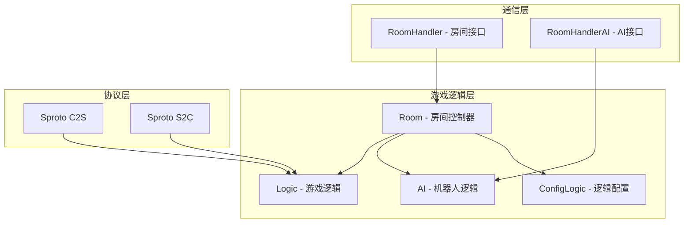

# 游戏逻辑文档

## 概述

游戏逻辑模块负责处理具体的游戏规则、玩家行为、AI交互和游戏结果计算。采用模块化设计，支持多种游戏类型的扩展。

## 逻辑架构

### 核心组件



### 模块职责

| 模块 | 文件 | 职责 |
|------|------|------|
| Room | room.lua | 房间控制器，协调各模块 |
| Logic | logic.lua | 游戏核心逻辑实现 |
| AI | ai.lua | 机器人行为控制 |
| ConfigLogic | configLogic.lua | 游戏逻辑配置 |

## 游戏逻辑实现 (Logic)

### 初始化

```lua
function logic.init(playerNum, rule, roomHandler)
    -- 初始化游戏参数
    logic.playerNum = playerNum
    logic.rule = rule
    logic.roomHandler = roomHandler
    
    -- 重置游戏状态
    logic.roundNum = 0
    logic.startTime = 0
    logic.gameData = {}
    
    -- 初始化玩家数据
    for i = 1, playerNum do
        logic.players[i] = {
            seat = i,
            score = 0,
            actions = {},
            status = "waiting"
        }
    end
end
```

### 游戏开始

```lua
function logic.startGame()
    logic.roundNum = logic.roundNum + 1
    logic.startTime = os.time()
    
    -- 发送游戏开始消息
    logic.sendGameStart(config.SEAT_FLAG.SEAT_ALL, {
        rule = logic.rule,
        players = logic.players
    })
    
    -- 初始化本轮游戏
    logic.initRound()
end
```

### 消息处理框架

```lua
-- 消息分发器
function logic.handleMessage(seat, msgName, msgData)
    local handler = logic.messageHandlers[msgName]
    if handler then
        handler(seat, msgData)
    else
        log.error("Unknown message: %s", msgName)
    end
end

-- 消息处理器注册
logic.messageHandlers = {
    ["playerAction"] = logic.onPlayerAction,
    ["playerReady"] = logic.onPlayerReady,
    ["gameOperation"] = logic.onGameOperation
}
```

### 玩家行为处理

```lua
function logic.onPlayerAction(seat, data)
    -- 1. 验证行为合法性
    if not logic.isValidAction(seat, data.action) then
        logic.sendError(seat, "Invalid action")
        return
    end
    
    -- 2. 记录玩家行为
    logic.recordAction(seat, data)
    
    -- 3. 更新游戏状态
    logic.updateGameState(seat, data)
    
    -- 4. 广播行为结果
    logic.broadcastAction(seat, data)
    
    -- 5. 检查游戏结束条件
    if logic.checkGameEnd() then
        logic.endGame()
    end
end
```

### 游戏结束处理

```lua
function logic.endGame()
    -- 1. 计算游戏结果
    local results = logic.calculateResults()
    
    -- 2. 发送游戏结束消息
    logic.sendGameEnd(config.SEAT_FLAG.SEAT_ALL, results)
    
    -- 3. 通知房间控制器
    logic.roomHandler.gameResult(results)
    
    -- 4. 清理游戏状态
    logic.cleanup()
end
```

## AI机器人逻辑 (AI)

### AI架构

```lua
local ai = {
    robots = {},        -- 机器人实例列表
    updateInterval = 1, -- 更新间隔(秒)
    lastUpdate = 0      -- 上次更新时间
}
```

### AI初始化

```lua
function ai.init(roomHandlerAi, robotCount)
    ai.roomHandlerAi = roomHandlerAi
    ai.robots = {}
    
    -- 创建机器人实例
    for i = 1, robotCount do
        local robot = ai.createRobot(i)
        table.insert(ai.robots, robot)
    end
end
```

### AI决策机制

```lua
function ai.update()
    local now = os.time()
    if now - ai.lastUpdate < ai.updateInterval then
        return
    end
    
    ai.lastUpdate = now
    
    -- 更新所有机器人
    for _, robot in ipairs(ai.robots) do
        ai.updateRobot(robot)
    end
end

function ai.updateRobot(robot)
    -- 1. 检查是否需要行动
    if not ai.shouldAct(robot) then
        return
    end
    
    -- 2. 分析当前局面
    local gameState = ai.analyzeGameState(robot)
    
    -- 3. 做出决策
    local action = ai.makeDecision(robot, gameState)
    
    -- 4. 执行行动
    if action then
        ai.executeAction(robot, action)
    end
end
```

### AI行为模式

```lua
-- AI难度等级
ai.DIFFICULTY = {
    EASY = 1,    -- 简单：随机行为为主
    NORMAL = 2,  -- 普通：基本策略
    HARD = 3     -- 困难：复杂策略
}

-- AI行为策略
function ai.makeDecision(robot, gameState)
    local strategy = ai.strategies[robot.difficulty]
    return strategy(robot, gameState)
end

ai.strategies = {
    [ai.DIFFICULTY.EASY] = function(robot, gameState)
        -- 简单AI：随机选择
        return ai.randomAction(gameState.validActions)
    end,
    
    [ai.DIFFICULTY.NORMAL] = function(robot, gameState)
        -- 普通AI：基本策略
        return ai.basicStrategy(robot, gameState)
    end,
    
    [ai.DIFFICULTY.HARD] = function(robot, gameState)
        -- 困难AI：高级策略
        return ai.advancedStrategy(robot, gameState)
    end
}
```

## 协议通信

### 协议结构

**客户端到服务端 (C2S)**:
```protobuf
.package {
    type 0 : integer
    session 1 : integer
}

playerAction 1 {
    request {
        action 0 : string
        params 1 : string
    }
}

playerReady 2 {
    request {
        ready 0 : integer
    }
}
```

**服务端到客户端 (S2C)**:
```protobuf
.package {
    type 0 : integer
    session 1 : integer
}

gameStart 1 {
    request {
        roundNum 0 : integer
        startTime 1 : integer
        roundData 2 : string
    }
}

gameEnd 2 {
    request {
        roundNum 0 : integer
        endTime 1 : integer
        roundData 2 : string
    }
}

actionResult 3 {
    request {
        seat 0 : integer
        action 1 : string
        result 2 : string
    }
}
```

### 消息发送接口

```lua
-- 发送给单个客户端
function logic.sendToOneClient(seat, msgName, data)
    logic.roomHandler.logicMsg(seat, msgName, data)
end

-- 发送给所有客户端
function logic.sendToAllClient(msgName, data)
    logic.roomHandler.logicMsg(0, msgName, data)
end

-- 发送游戏开始消息
function logic.sendGameStart(toseat, roundData)
    local data = {
        roundNum = logic.roundNum,
        startTime = logic.startTime,
        roundData = roundData or ""
    }
    
    if toseat == config.SEAT_FLAG.SEAT_ALL then
        logic.sendToAllClient("gameStart", data)
    else
        logic.sendToOneClient(toseat, "gameStart", data)
    end
end
```

## 游戏状态管理

### 状态数据结构

```lua
logic.gameState = {
    phase = "waiting",      -- 游戏阶段
    round = 1,              -- 当前轮次
    turn = 1,               -- 当前回合
    activePlayer = 1,       -- 当前行动玩家
    timeLeft = 30,          -- 剩余时间
    boardState = {},        -- 棋盘/游戏状态
    playerStates = {}       -- 玩家状态
}
```

### 状态同步

```lua
function logic.syncGameState()
    local stateData = {
        phase = logic.gameState.phase,
        round = logic.gameState.round,
        turn = logic.gameState.turn,
        activePlayer = logic.gameState.activePlayer,
        timeLeft = logic.gameState.timeLeft
    }
    
    logic.sendToAllClient("gameStateSync", stateData)
end
```

## 游戏规则引擎

### 规则定义

```lua
-- 游戏规则配置
local rules = {
    maxPlayers = 2,         -- 最大玩家数
    maxRounds = 3,          -- 最大轮数
    turnTimeLimit = 30,     -- 回合时间限制
    scoreToWin = 100,       -- 获胜分数
    
    -- 自定义规则
    customRules = {
        allowUndo = false,   -- 是否允许悔棋
        showOpponentCards = false, -- 是否显示对手牌
        doubleScore = false  -- 是否双倍分数
    }
}
```

### 规则验证

```lua
function logic.isValidAction(seat, action)
    -- 1. 检查玩家状态
    if not logic.isPlayerActive(seat) then
        return false, "Not your turn"
    end
    
    -- 2. 检查行动合法性
    if not logic.isActionAllowed(action) then
        return false, "Invalid action"
    end
    
    -- 3. 检查游戏规则
    if not logic.checkGameRules(seat, action) then
        return false, "Rule violation"
    end
    
    return true
end
```

## 结果计算

### 分数计算

```lua
function logic.calculateScore(seat, actions)
    local score = 0
    
    -- 基础分数计算
    for _, action in ipairs(actions) do
        score = score + logic.getActionScore(action)
    end
    
    -- 奖励分数
    local bonus = logic.calculateBonus(seat)
    score = score + bonus
    
    -- 规则修正
    score = logic.applyRuleModifiers(seat, score)
    
    return math.max(0, score) -- 确保分数不为负
end
```

### 胜负判定

```lua
function logic.determineWinner()
    local scores = {}
    
    -- 计算所有玩家分数
    for i = 1, logic.playerNum do
        scores[i] = logic.calculateFinalScore(i)
    end
    
    -- 找出最高分
    local maxScore = math.max(table.unpack(scores))
    local winners = {}
    
    for i = 1, logic.playerNum do
        if scores[i] == maxScore then
            table.insert(winners, i)
        end
    end
    
    return winners, scores
end
```

## 性能优化

### 计算优化

```lua
-- 缓存计算结果
logic.cache = {}

function logic.getCachedResult(key, calculator)
    if not logic.cache[key] then
        logic.cache[key] = calculator()
    end
    return logic.cache[key]
end

-- 批量处理
function logic.batchUpdate(updates)
    -- 收集所有更新
    for _, update in ipairs(updates) do
        logic.pendingUpdates[update.type] = logic.pendingUpdates[update.type] or {}
        table.insert(logic.pendingUpdates[update.type], update)
    end
    
    -- 批量执行
    logic.flushUpdates()
end
```

### 内存管理

```lua
function logic.cleanup()
    -- 清理游戏数据
    logic.gameState = nil
    logic.playerActions = {}
    logic.cache = {}
    
    -- 重置状态
    logic.roundNum = 0
    logic.startTime = 0
end
```

## 调试和测试

### 调试接口

```lua
-- 调试信息输出
function logic.debug()
    local info = {
        gameState = logic.gameState,
        playerStates = logic.players,
        roundNum = logic.roundNum,
        cache = logic.cache
    }
    
    log.debug("Game Logic Debug: %s", UTILS.tableToString(info))
    return info
end

-- 强制游戏结束（测试用）
function logic.forceEndGame(reason)
    log.warn("Force end game: %s", reason)
    logic.endGame()
end
```

### 单元测试

```lua
-- 测试用例
function logic.runTests()
    local tests = {
        test_playerAction,
        test_gameEnd,
        test_scoreCalculation,
        test_aiDecision
    }
    
    for _, test in ipairs(tests) do
        local success, err = pcall(test)
        if not success then
            log.error("Test failed: %s", err)
        end
    end
end
```

## 扩展指南

### 添加新游戏类型

1. **创建游戏目录**:
   ```
   src/services/games/{new_gameid}/
   ├── config.lua
   ├── room.lua
   ├── logic.lua
   ├── ai.lua
   └── configLogic.lua
   ```

2. **实现核心逻辑**:
   - 继承BaseRoom或PrivateRoom
   - 实现游戏特定的logic模块
   - 配置AI行为策略

3. **添加协议定义**:
   - 创建对应的sproto协议文件
   - 定义客户端和服务端消息格式

4. **更新配置**:
   - 在games/config.lua中添加新游戏ID
   - 配置游戏特定参数

### 自定义AI策略

```lua
-- 添加新的AI难度等级
ai.DIFFICULTY.EXPERT = 4

ai.strategies[ai.DIFFICULTY.EXPERT] = function(robot, gameState)
    -- 实现专家级AI策略
    return ai.expertStrategy(robot, gameState)
end

function ai.expertStrategy(robot, gameState)
    -- 复杂的决策算法
    local bestAction = ai.minimax(gameState, 5) -- 5层搜索
    return bestAction
end
```