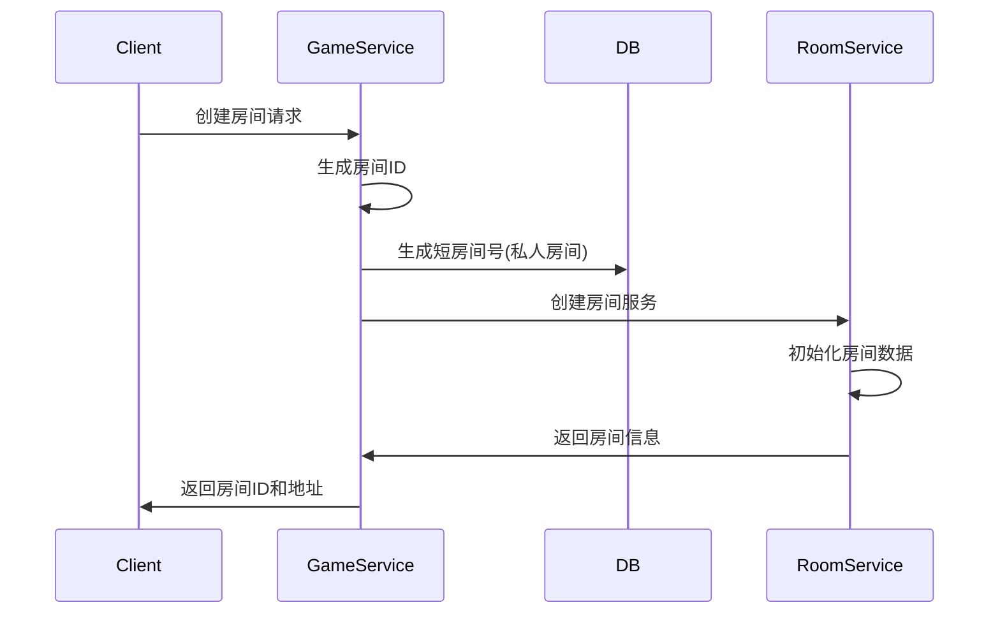
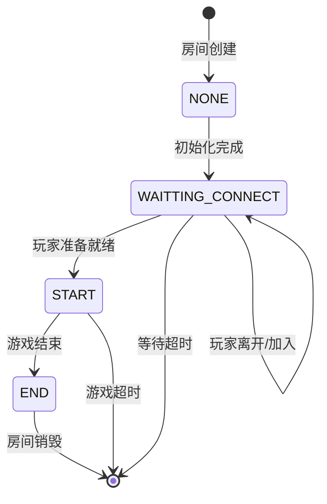

# 房间管理文档

## 概述

房间管理是Games服务的核心功能，负责游戏房间的创建、生命周期管理、状态监控和资源清理。

## 房间类型

### 1. 匹配房间 (MATCH)

**特点**:
- 系统自动匹配玩家
- 房间创建后立即开始游戏流程
- 玩家无法中途离开
- 支持AI机器人填充

**使用场景**:
- 快速匹配游戏
- 竞技对战
- 排位赛

**配置参数**:
```lua
{
    roomType = CONFIG.ROOM_TYPE.MATCH,
    roomWaitingConnectTime = 8,     -- 等待连接时间(秒)
    roomGameTime = 900              -- 游戏时间(秒)
}
```

### 2. 私人房间 (PRIVATE)

**特点**:
- 玩家自主创建和管理
- 房主拥有管理权限
- 支持玩家动态加入/离开
- 自定义游戏规则

**使用场景**:
- 好友对战
- 自定义规则游戏
- 练习模式

**配置参数**:
```lua
{
    roomType = CONFIG.ROOM_TYPE.PRIVATE,
    roomWaitingConnectTime = 7200,  -- 等待连接时间(秒)
    roomGameTime = 7200,            -- 游戏时间(秒)
    owner = userid,                 -- 房主ID
    shortRoomid = 123456,          -- 6位短房间号
    privateRule = {                 -- 自定义规则
        playerCnt = 2,
        battleCnt = 1
    }
}
```

## 房间生命周期

### 1. 房间创建阶段



**关键步骤**:
1. **ID生成**: 使用雪花算法生成全局唯一房间ID
2. **服务创建**: 通过`skynet.newservice`创建独立房间服务
3. **数据初始化**: 设置房间基础信息和玩家列表
4. **状态设置**: 初始状态为`WAITTING_CONNECT`

### 2. 等待连接阶段

**状态**: `GAME_STATUS.WAITTING_CONNECT`

**主要任务**:
- 等待玩家连接到房间
- 处理玩家加入/离开请求
- 检查是否满足游戏开始条件
- 超时检查和清理

**玩家连接流程**:
```lua
function BaseRoom:connect(userid, fd)
    -- 1. 验证玩家身份
    if not self.players[userid] then
        return {code = 0, msg = "玩家不在房间中"}
    end
    
    -- 2. 更新连接信息
    self.players[userid].clientFd = fd
    self.players[userid].status = self.config.PLAYER_STATUS.ONLINE
    
    -- 3. 发送房间信息
    self:sendRoomInfo(userid)
    
    -- 4. 检查是否可以开始游戏
    self:testStart()
end
```

### 3. 游戏进行阶段

**状态**: `GAME_STATUS.START`

**主要任务**:
- 处理游戏逻辑
- 消息分发和路由
- AI机器人行为处理
- 玩家状态同步

**游戏开始流程**:
```lua
function Room:startGame()
    -- 1. 更新房间状态
    self.roomInfo.gameStatus = config.GAME_STATUS.START
    self.roomInfo.gameStartTime = os.time()
    
    -- 2. 初始化游戏逻辑
    self:initLogic()
    self.logicHandler.startGame()
    
    -- 3. 记录开始日志
    self:pushLog(config.LOG_TYPE.GAME_START, 0, "")
    
    -- 4. 通知客户端
    self:sendToAllClient("gameStart", gameStartData)
end
```

### 4. 游戏结束阶段

**状态**: `GAME_STATUS.END`

**主要任务**:
- 计算游戏结果
- 更新玩家数据
- 记录游戏日志
- 准备房间销毁

### 5. 房间销毁阶段

**触发条件**:
- 游戏正常结束
- 房间超时
- 所有玩家离开
- 手动销毁

**销毁流程**:
```lua
function BaseRoom:destroy()
    -- 1. 设置销毁标志
    self.roomInfo.canDestroy = true
    
    -- 2. 清理玩家状态
    for userid, player in pairs(self.players) do
        self:setUserStatus(userid, self.gConfig.USER_STATUS.FREE)
    end
    
    -- 3. 记录销毁日志
    self:pushLog(config.LOG_TYPE.DESTROY_ROOM, 0, "")
    
    -- 4. 通知游戏管理器
    skynet.call(self.gameManager, "lua", "destroyGame", self.roomInfo.gameid, self.roomInfo.roomid)
end
```

## 房间状态管理

### 状态定义

```lua
GAME_STATUS = {
    NONE = 0,              -- 初始状态
    WAITTING_CONNECT = 1,  -- 等待玩家连接
    START = 2,             -- 游戏进行中
    END = 3                -- 游戏结束
}
```

### 状态转换规则



### 状态检查方法

```lua
-- 基础状态检查
function BaseRoom:isRoomStatus(status)
    return self.roomInfo.gameStatus == status
end

-- 便捷方法
function BaseRoom:isRoomStatusWaittingConnect()
    return self:isRoomStatus(self.config.GAME_STATUS.WAITTING_CONNECT)
end

function BaseRoom:isRoomStatusStarting()
    return self:isRoomStatus(self.config.GAME_STATUS.START)
end
```

## 玩家管理

### 玩家数据结构

```lua
player = {
    userid = 1001,
    seat = 1,                           -- 座位号(1-based)
    status = PLAYER_STATUS.ONLINE,      -- 玩家状态
    clientFd = 123,                     -- 客户端连接描述符
    isRobot = false,                    -- 是否为机器人
    enterTime = 1234567890              -- 进入时间
}
```

### 玩家状态管理

```lua
PLAYER_STATUS = {
    LOADING = 1,   -- 加载中(连接但未完成初始化)
    OFFLINE = 2,   -- 离线(断开连接)
    ONLINE = 3,    -- 在线(已连接)
    PLAYING = 4,   -- 游戏中(正在游戏)
    READY = 5      -- 准备状态(准备开始游戏)
}
```

### 座位分配机制

**匹配房间**:
- 座位在房间创建时确定
- 按玩家列表顺序分配座位
- 座位不可更改

**私人房间**:
- 房主默认占据座位1
- 新玩家加入时自动分配空闲座位
- 支持玩家离开后座位回收

```lua
function PrivateRoom:dispatchSeat()
    for i = 1, self.roomInfo.playerNum do
        if not self.roomInfo.playerids[i] then
            return i
        end
    end
    return nil -- 无空闲座位
end
```

## 超时管理

### 超时类型

1. **等待连接超时**: 玩家连接房间的最大等待时间
2. **游戏超时**: 游戏进行的最大时间
3. **空闲超时**: 房间无活动的最大时间

### 超时检查机制

```lua
function BaseRoom:checkRoomTimeout()
    local now = os.time()
    local createTime = self.roomInfo.createRoomTime
    
    if self:isRoomStatusWaittingConnect() then
        -- 检查等待连接超时
        if now - createTime > self.roomInfo.roomWaitingConnectTime then
            self:onRoomTimeout("WAITING_CONNECT_TIMEOUT")
        end
    elseif self:isRoomStatusStarting() then
        -- 检查游戏超时
        local gameTime = now - self.roomInfo.gameStartTime
        if gameTime > self.roomInfo.roomGameTime then
            self:onRoomTimeout("GAME_TIMEOUT")
        end
    end
end
```

### 超时处理

```lua
function BaseRoom:onRoomTimeout(reason)
    log.warn("Room timeout: %s, roomid: %s", reason, self.roomInfo.roomid)
    
    -- 记录超时日志
    self:pushLog(self.config.LOG_TYPE.ROOM_TIMEOUT, 0, reason)
    
    -- 结束游戏并销毁房间
    self:endGame(reason)
    self:destroy()
end
```

## 房间监控

### 监控指标

1. **房间数量**: 当前活跃房间总数
2. **玩家分布**: 各房间的玩家数量分布
3. **房间状态**: 各状态房间的数量统计
4. **平均游戏时长**: 游戏的平均持续时间
5. **超时率**: 房间超时的比例

### 监控实现

```lua
-- 获取房间统计信息
function CMD.getRoomStats()
    local stats = {
        totalRooms = 0,
        roomsByGame = {},
        roomsByStatus = {
            [config.GAME_STATUS.WAITTING_CONNECT] = 0,
            [config.GAME_STATUS.START] = 0,
            [config.GAME_STATUS.END] = 0
        }
    }
    
    for gameid, rooms in pairs(allGames) do
        stats.roomsByGame[gameid] = 0
        for roomid, room in pairs(rooms) do
            stats.totalRooms = stats.totalRooms + 1
            stats.roomsByGame[gameid] = stats.roomsByGame[gameid] + 1
            -- 统计房间状态需要调用房间服务获取
        end
    end
    
    return stats
end
```

## 房间配置

### 全局配置

```lua
-- src/services/games/config.lua
local config = {
    gameids = {10001, 10002}  -- 支持的游戏ID列表
}
```

### 游戏特定配置

```lua
-- src/services/games/10001/config.lua
local config = {
    -- 房间等待时间配置
    MATCH_ROOM_WAITTING_CONNECT_TIME = 8,
    PRIVATE_ROOM_WAITTING_CONNECT_TIME = 7200,
    
    -- 游戏时间配置
    MATCH_ROOM_GAME_TIME = 900,
    PRIVATE_ROOM_GAME_TIME = 7200,
    
    -- 协议配置
    SPROTO = {
        C2S = "game10001_c2s",
        S2C = "game10001_s2c"
    }
}
```

## 最佳实践

### 1. 房间创建优化

- 使用对象池复用房间服务
- 预加载协议文件到sharedata
- 批量创建减少系统调用

### 2. 内存管理

- 及时清理断开连接的玩家数据
- 使用弱引用避免循环依赖
- 定期检查和清理僵尸房间

### 3. 性能优化

- 消息批量处理减少网络IO
- AI逻辑异步执行避免阻塞
- 使用本地缓存减少数据库查询

### 4. 异常处理

- 完善的超时检查机制
- 玩家异常断线恢复
- 房间状态异常修复

### 5. 日志记录

- 记录关键房间事件
- 保留足够的调试信息
- 定期清理历史日志